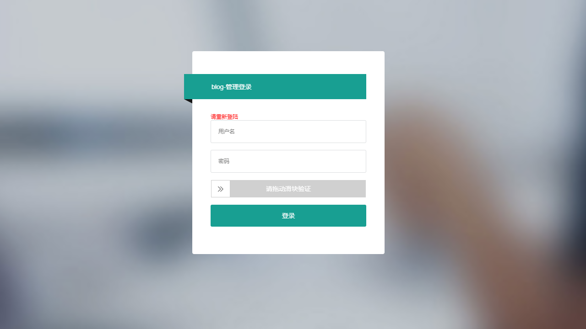
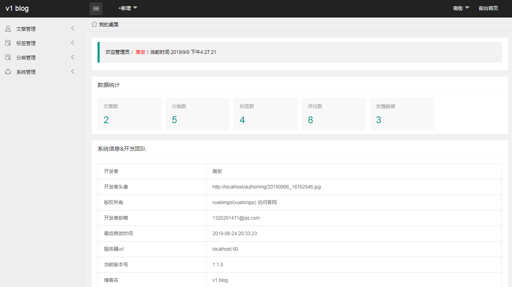
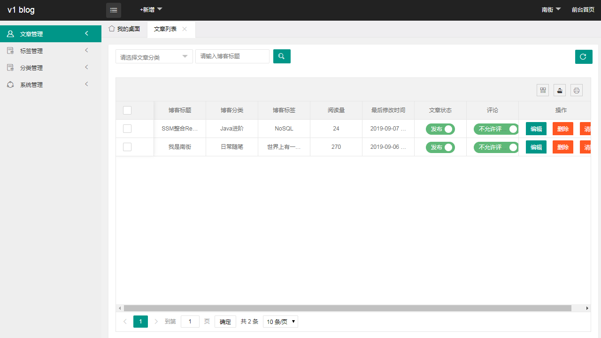
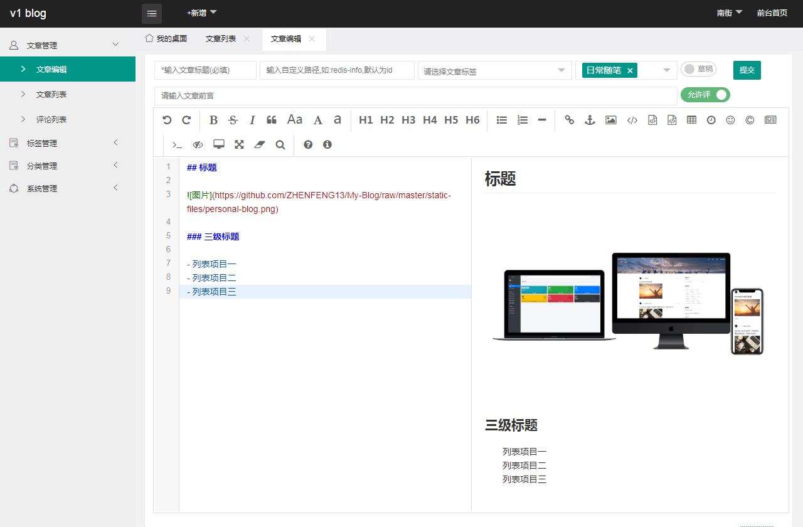
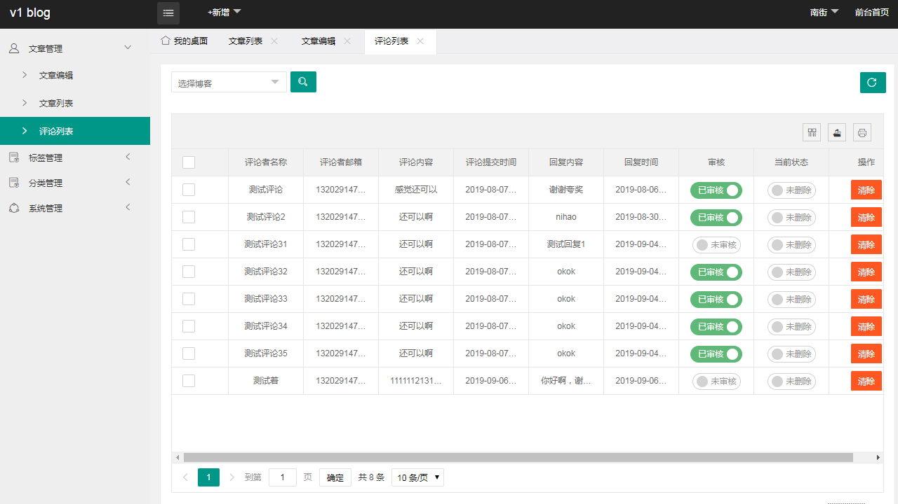
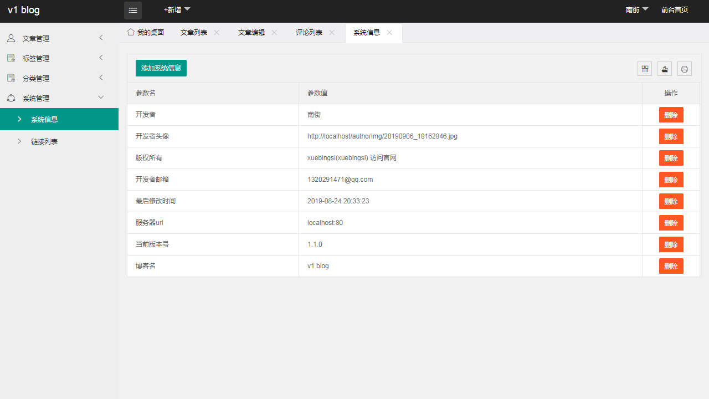

# My-Blog-layui


**坚持不易，各位朋友如果觉得项目还不错的话可以给项目一个 star 吧，也是对我们一直更新代码的一种鼓励啦，谢谢各位的支持。**

- **该项目基于原 [My-Blog](https://github.com/ZHENFENG13/My-Blog) 项目二次开发的 Spring Boot 实践项目，后台和博客的分页and评论采用全新的 layui 进行重构；**
- **你可以把它作为 SpringBoot 技术栈的学习项目，My Blog 也足够符合要求，且代码和功能完备；**
- **技术栈新颖且知识点丰富，学习后可以提升大家对于知识的理解和掌握；**
- **在原 [My-Blog](https://github.com/ZHENFENG13/My-Blog) 项目的基础上增加了 lombok 、MyBatis-Plus 框架的使用，数据源也切换为 Druid 数据源。**

> 更多 Spring Boot 实战项目可以关注十三的另一个代码仓库 [spring-boot-projects](https://github.com/ZHENFENG13/spring-boot-projects)，该仓库中主要是 Spring Boot 的入门学习教程以及一些常用的 Spring Boot 实战项目教程，包括 Spring Boot 使用的各种示例代码，同时也包括一些实战项目的项目源码和效果展示，实战项目包括基本的 web 开发以及目前大家普遍使用的前后端分离实践项目等，后续会根据大家的反馈继续增加一些实战项目源码，摆脱各种 hello world 入门案例的束缚，真正的掌握 Spring Boot 开发。

## 使用说明

- **数据库文件目录为```static-files/my_blog_db.sql```，与原 My-Blog 项目的 SQL 文件有一些小差别；**

- **部署后你可以根据自己需求修改版权文案、logo 图片、备案记录等网站基础信息；**

- **My Blog layui 后台管理系统的默认登陆账号为 admin 默认登陆密码为 000000；**

- **有任何问题都可以反馈给我们，我们会尽量完善该项目。**

## 十三的感想

My-Blog-layui 的开发者是朱同学，是我在 QQ 群里认识的一位朋友，通过交流得知他是一名大三的学生，我惊讶不已，虽然该项目是在我的 My-Blog 项目的基础上进行二次开发的，但是可以通过该项目的代码看出朱同学对于相关技术栈的掌握度很好，回想起大三时的自己，那时的我好像只会用 JSP + Servlet 开发一些简单的小功能，真心觉得现在的学生特别牛X，自愧不如。在此也由衷的希望各位在校的朋友以及已经工作的朋友，如果想要继续走在开发的道路上，都能够静下心来好好学学，认真实践，在互联网开发的道路上收获属于自己的精彩。

## 联系作者

> 大家有任何问题或者建议都可以在 [issues]中反馈，我们会慢慢完善这个项目。

- 南街的邮箱：1320291471@qq.com
- 十三的邮箱：2449207463@qq.com
- QQ技术交流群：796794009


## 效果预览

### 后台管理页面

- 登录页

	

- 后台首页

	

- 文章管理

	

- 文章编辑

	

- 评论管理

	

- 系统配置

	

### 博客展示页面

- 首页

  

- 文章浏览

  

- 友情链接

  
  
- 评论版块

  

## 感谢

- [Linn-cn](https://github.com/Linn-cn)
- [sentsin](https://github.com/sentsin/layui)
- [spring-projects](https://github.com/spring-projects/spring-boot)
- [pandao](https://github.com/pandao/editor.md)
- [zjhch123](https://github.com/zjhch123/solo-skin-amaze)
